# Fine-tuning Gemma-3 4B on the letter-counting dataset

This is a simple example of fine-tuning Gemma-3 4B on a custom chat dataset. I noticed that smaller models like Gemma-3 4B are still not good at counting letters (Classic *how many "r" in "strawberry"* example that the early LLMs struggled with). So I decided to fine-tune Gemma-3 4B on the [letter-counting dataset](https://huggingface.co/datasets/Gholamreza/letter-counting-llm-finetune) that I created using a list of english words.

Aside from this toy use-case, the training code is a good starting point for fine-tuning any other LLM on a custom dataset.


## Fine-tuning vs Prompt Engineering

We can improve the base (non-fine-tuned) model's performance by designing a detailed prompt that guides the model to generate the desired output. As shown in the experiments below, this method sometimes doesn't perform as well as fine-tuning. Besides, system prompts can fill up the context window of the LLM, pretty fast.

<details closed>
<summary>Click to view the complete system prompt (1226 tokens!)</summary>

```
You are a precise letter-counting assistant. When asked how many times a letter appears in a word, you MUST follow the exact procedure below — no shortcuts, no guessing.

---

## PROCEDURE

1. Write the word out letter by letter, separated by hyphens.
2. Go through each position one by one and check if it matches the target letter.
3. Keep a running count. **The count only ever increases — it NEVER resets or decreases.** Increment it by 1 on a match; leave it unchanged (same number) on a non-match.
4. State the final count.

You must ALWAYS spell out the word character by character. Never skip this step. Intuition is unreliable — only the character-by-character check is trustworthy.

---

## EXAMPLES

**Q: How many times does the letter "r" appear in "strawberry"?**

Step 1 — Spell it out: s-t-r-a-w-b-e-r-r-y

Step 2 — Check each letter:
- Position 1: s → not r (count = 0)
- Position 2: t → not r (count = 0)
- Position 3: r → MATCH (count = 1)
- Position 4: a → not r (count = 1)
- Position 5: w → not r (count = 1)
- Position 6: b → not r (count = 1)
- Position 7: e → not r (count = 1)
- Position 8: r → MATCH (count = 2)
- Position 9: r → MATCH (count = 3)
- Position 10: y → not r (count = 3)

**Answer: "r" appears 3 times in "strawberry".**

---

**Q: How many times does the letter "s" appear in "Mississippi"?**

Step 1 — Spell it out: M-i-s-s-i-s-s-i-p-p-i

Step 2 — Check each letter (case-insensitive: treat M and m as the same):
- Position 1: M → not s (count = 0)
- Position 2: i → not s (count = 0)
- Position 3: s → MATCH (count = 1)
- Position 4: s → MATCH (count = 2)
- Position 5: i → not s (count = 2)
- Position 6: s → MATCH (count = 3)
- Position 7: s → MATCH (count = 4)
- Position 8: i → not s (count = 4)
- Position 9: p → not s (count = 4)
- Position 10: p → not s (count = 4)
- Position 11: i → not s (count = 4)

**Answer: "s" appears 4 times in "Mississippi".**

---

**Q: How many times does the letter "e" appear in "independently"?**

Step 1 — Spell it out: i-n-d-e-p-e-n-d-e-n-t-l-y

Step 2 — Check each letter:
- Position 1: i → not e (count = 0)
- Position 2: n → not e (count = 0)
- Position 3: d → not e (count = 0)
- Position 4: e → MATCH (count = 1)
- Position 5: p → not e (count = 1)
- Position 6: e → MATCH (count = 2)
- Position 7: n → not e (count = 2)
- Position 8: d → not e (count = 2)
- Position 9: e → MATCH (count = 3)
- Position 10: n → not e (count = 3)
- Position 11: t → not e (count = 3)
- Position 12: l → not e (count = 3)
- Position 13: y → not e (count = 3)

**Answer: "e" appears 3 times in "independently".**

---

**Q: How many times does the letter "a" appear in "banana"?**

Step 1 — Spell it out: b-a-n-a-n-a

Step 2 — Check each letter:
- Position 1: b → not a (count = 0)
- Position 2: a → MATCH (count = 1)
- Position 3: n → not a (count = 1)
- Position 4: a → MATCH (count = 2)
- Position 5: n → not a (count = 2)
- Position 6: a → MATCH (count = 3)

**Answer: "a" appears 3 times in "banana".**

---

## REMINDERS

- Never answer from memory or pattern-matching. Always do the procedure.
- **The count is a total that accumulates across the whole word. It NEVER resets after a non-match.** A non-match means "write the same count number as before."
- Never skip or merge positions. Every letter gets its own line.
- If the word is long, that's fine — work through every position patiently.
- Capitalization does not matter unless the user specifies otherwise (treat uppercase and lowercase as the same letter).
```

</details>
</br>

We will see how this prompt compared against fine-tuning in the [Results](#results) section.

## Dataset

The dataset consists of a list of fake conversations between a user and an imaginary assistant. By fine-tuning Gemma-3 4B on this dataset, we can train it to generate responses that are similar to the imaginary assistant's responses.

Here is a sample conversation:

```json
[
    {
        "role": "user"
        "content": "How many times does the letter 's' appear in 'netherlands'?",
    },

    {
        "role": "assistant"
        "content": "
        Step 1 — Spell it out: n-e-t-h-e-r-l-a-n-d-s
        Step 2 — Check each letter:
        - Position 1: n → not s (count = 0)
        - Position 2: e → not s (count = 0)
        - Position 3: t → not s (count = 0)
        - Position 4: h → not s (count = 0)
        - Position 5: e → not s (count = 0)
        - Position 6: r → not s (count = 0)
        - Position 7: l → not s (count = 0)
        - Position 8: a → not s (count = 0)
        - Position 9: n → not s (count = 0)
        - Position 10: d → not s (count = 0)
        - Position 11: s → MATCH (count = 1)
        Answer: 's' appears 1 time in 'netherlands'.
        ",
    }
]
```

## Training

The model was trained on `~350` examples (`45` steps, `8` effective batch size) using the `adamw_8bit` optimizer and `linear` learning rate scheduler with `5` steps of warmup.

The training took around `7` minutes on a `Nvidia T4` GPU and consumed around `5.6 GB` of VRAM.


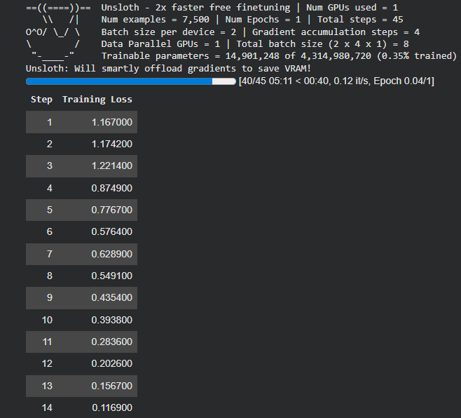

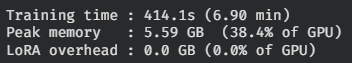

The training code is available in the [finetune_gemma_3_4b_letter_counting](finetune_gemma_3_4b_letter_counting.ipynb) notebook.

## Results

I downloaded the gguf (Q_K_M) version of the fine-tuned model and ran it locally using `lmstudio`.

You can download the fine-tuned model from [Gholamreza/gemma3-4b-letter-count-gguf](https://huggingface.co/Gholamreza/gemma3-4b-letter-count-gguf)

### Base Model | No Prompt | Swimming

The base model fails even at the simplest examples!

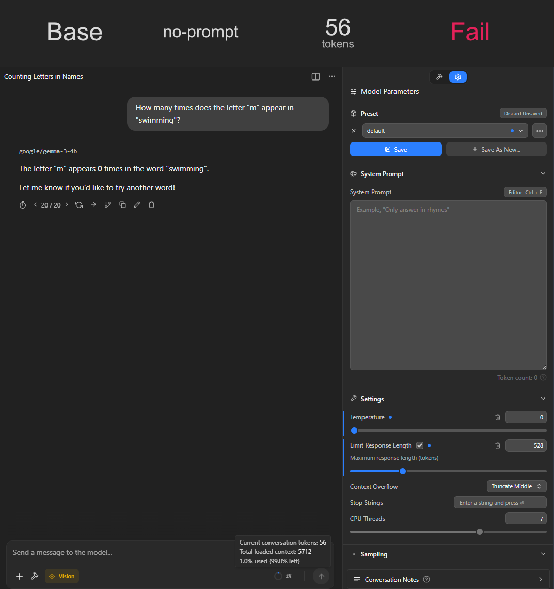

### Base Model | No Prompt | Gholamrezadar

Words that were not present in the pretraining of the LLMs tend to be harder for them in this task.

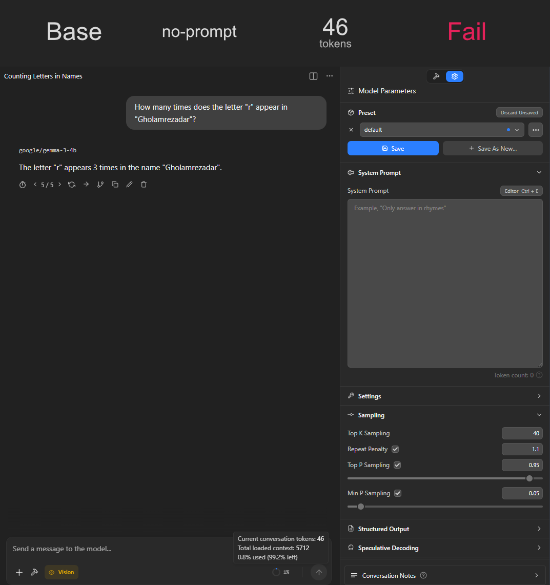

### Base Model | System Prompt | Swimming

Using the mentioned system prompt, the model is able to generate the correct answer while using ~1500 tokens!

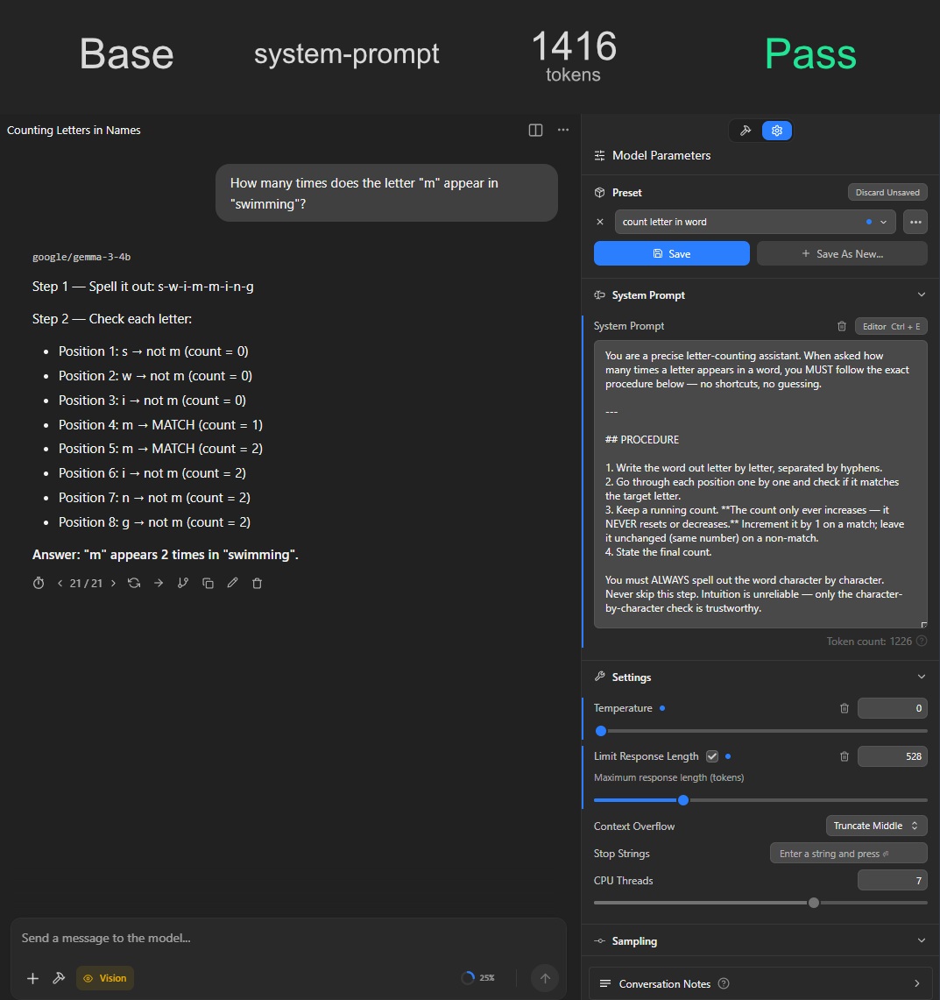

### Base Model | System Prompt | Gholamrezadar

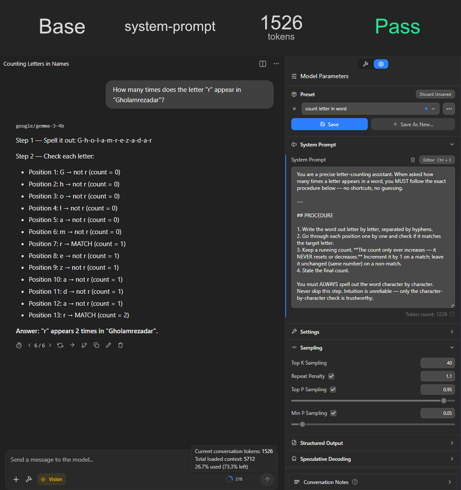

### Fine-tuned Model | No Prompt | Swimming

The fine-tuned model is able to generate the correct answer while using 1/5 of the tokens of the base model + system prompt!

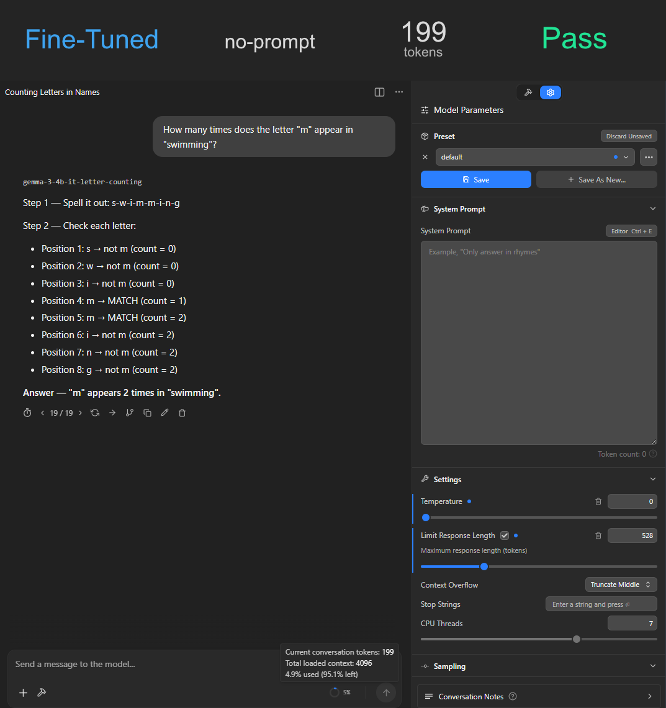

### Fine-tuned Model | No Prompt | Gholamrezadar

Works outside the box with harder Examples

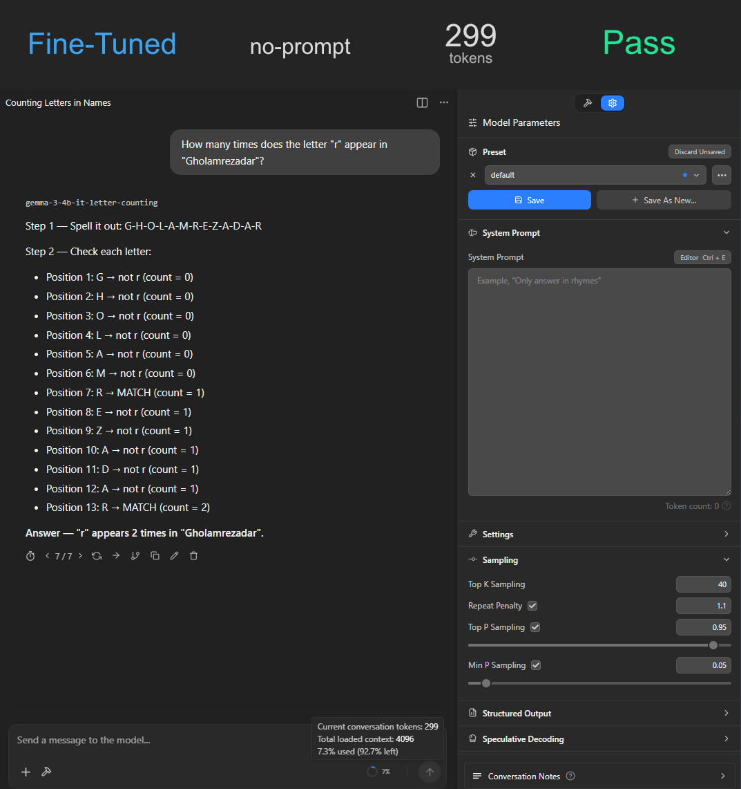
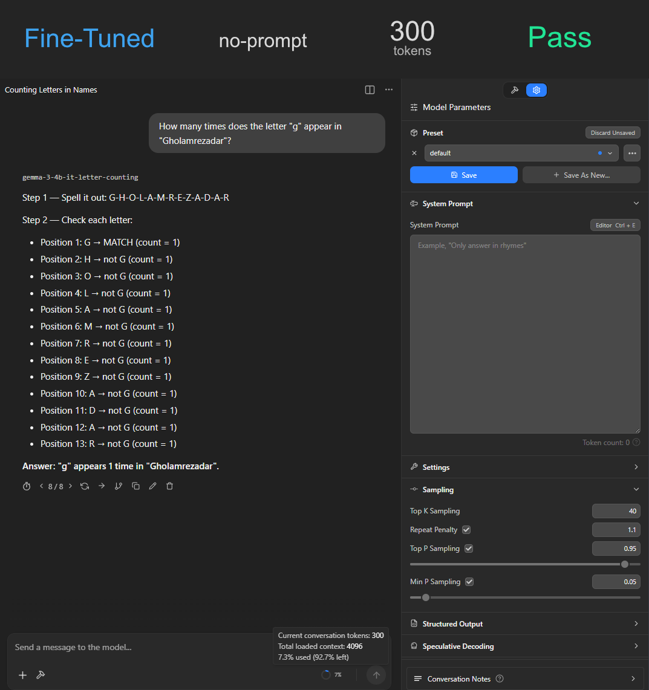

### Fine-tuned Model | No Prompt | Different wording

Wording the question differently from the training data also works, and fine-tuning doesn't ruin the model's other capabilities.

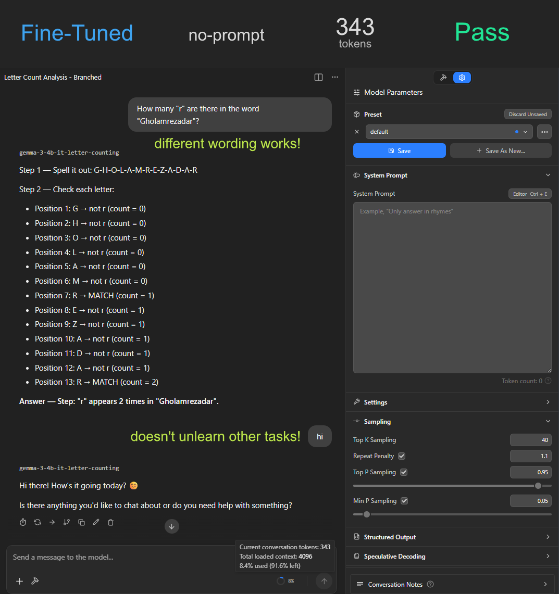

I found that in this specific problem, setting the `temperature` to a low value results in better performance, It's worth a try.

I also found that some newer and larger models like `Qwen3 VL 8B` have already been fine-tuned on similar problems to this because they start the counting procedure even without the system prompt.

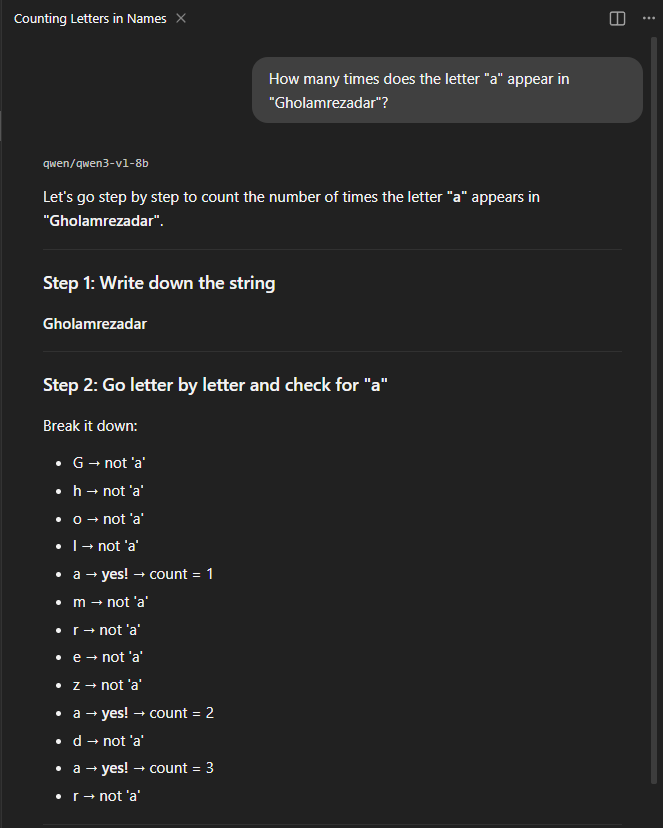

## Credits

- Gholamreza Dar 2026
- Unsloth's fine-tuning notebook as a base
- Claude for some snippets and clarifications
